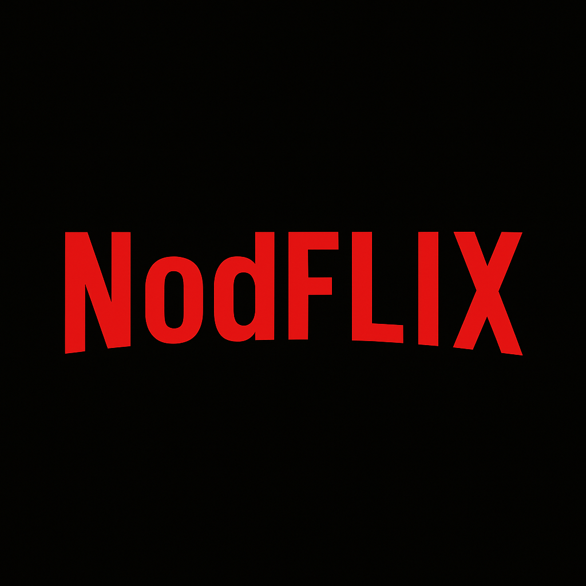

# 🎬 NodoCine Frontend - Plataforma de Streaming

Este proyecto es una plataforma de streaming inspirada en Netflix, que permite a los usuarios crear perfiles (adultos e infantiles), explorar un catálogo de películas y mantener listas de películas personalizadas para cada perfil.



## 🚀 Características

- **Gestión de cuentas y perfiles**
  - Sistema de autenticación (registro/login)
  - Creación y gestión de perfiles múltiples
  - Modo infantil con restricción de contenido

- **Catálogo de películas**
  - Exploración del catálogo completo
  - Detalles de películas con información de OMDB API
  - Filtrado por título, director y género
  - Búsquedas personalizadas

- **Watchlist por perfil**
  - Lista personalizada para cada perfil
  - Añadir/eliminar películas de la lista

- **Panel de administración**
  - Gestión de usuarios
  - Gestión de películas (añadir/editar/eliminar)
  - Estadísticas de uso

- **Diseño responsivo**
  - Interfaz adaptable a distintos dispositivos
  - Tema claro/oscuro

## 🛠️ Tecnologías

- **React 18 + Vite**
- **TailwindCSS v4**
- **Context API** para manejo de estados globales
- **React Router v6** para navegación
- **Axios** para comunicación con el backend
- **React Toastify** para notificaciones

## 📋 Requisitos previos

- Node.js (v16 o superior)
- NPM o Yarn
- Una cuenta en [OMDB API](https://www.omdbapi.com/) para obtener una API key

## ⚙️ Instalación y configuración

1. **Clona el repositorio:**
   ```bash
   git clone https://github.com/tu-usuario/nodo-cine-frontend.git
   cd nodo-cine-frontend
   ```

2. **Instala las dependencias:**
   ```bash
   npm install
   # o
   yarn install
   ```

3. **Crea un archivo .env en la raíz del proyecto:**
   ```
   VITE_API_URL=http://localhost:3001/api
   VITE_IMAGES_URL=http://localhost:3001/images/profiles
   VITE_OMDB_API_KEY=tu_clave_api_omdb
   ```

4. **Inicia el servidor de desarrollo:**
   ```bash
   npm run dev
   # o
   yarn dev
   ```

5. **Abre tu navegador en la URL:**
   ```
   http://localhost:5173
   ```

## 🚀 Despliegue en Netlify

1. Crea una cuenta en [Netlify](https://www.netlify.com/)
2. Conecta tu repositorio de GitHub
3. Configura las siguientes variables de entorno en Netlify:
   ```
   VITE_API_URL=https://tu-backend.onrender.com/api
   VITE_IMAGES_URL=https://tu-backend.onrender.com/images/profiles
   VITE_OMDB_API_KEY=tu_clave_api_omdb
   ```
4. Configura los siguientes ajustes de compilación:
   - Build command: `npm run build`
   - Publish directory: `dist`

## 🌐 Uso de la aplicación

### Como administrador:
1. **Inicia sesión** con las credenciales de administrador
   - Email: `admin@admin.com`
   - Contraseña: (la que hayas configurado)
2. Accede al **Panel de Administración**
3. Desde allí puedes:
   - Ver estadísticas
   - Gestionar películas
   - Crear cuentas familiares

### Como usuario familiar:
1. **Inicia sesión** con la cuenta familiar creada por el administrador
2. **Selecciona o crea** un perfil
3. **Explora** el catálogo de películas
4. **Añade películas** a tu lista personal
5. **Cambia de perfil** cuando lo desees

### Restricciones para perfiles infantiles:
- Solo verán películas de animación o con rating menor a 7
- Interfaz adaptada para niños

## 🔄 Integración con Back-End

El frontend se comunica con un backend Node.js + Express + MongoDB. Asegúrate de tener el backend ejecutándose para el funcionamiento completo.

## 📝 Pendientes y mejoras futuras
- Implementación de paginación desde el servidor
- Visualización de trailers directamente en la plataforma
- Sistema de calificación de películas por parte de los usuarios

## 👥 Autor

- **Tu Nombre** - [GitHub](https://github.com/vilmaponce)

## 📄 Licencia

Este proyecto está bajo la Licencia MIT - ver el archivo [LICENSE.md](LICENSE.md) para más detalles.